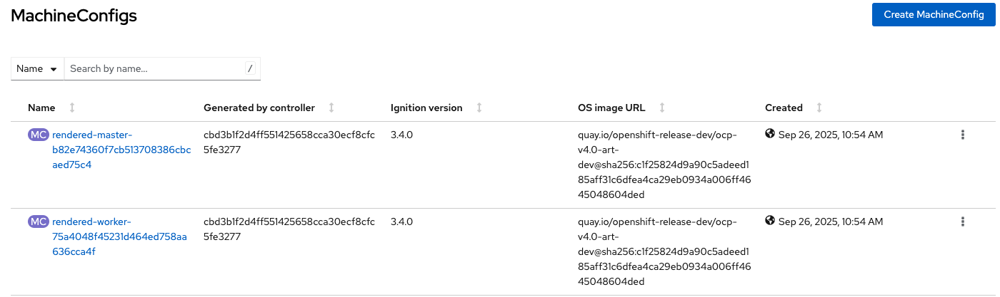

## Configuring the OCP Cluster for Airgap Installation

Pointing the cluster to the registry

1. Provision the OCP on Fyre 
- chose 4.16.47

2. Add the storageclasses
- using rook ceph => resorted to a situation where it is trying to pull an image from quay.io/ceph, which isn't mirrored
or
- run `mas provision-fyre` to install nfs storage

3. Check for any image content source policy and delete if there is one.

4. oc image mirror --dir $LOCAL_DIR/cli quay.io/ibmmas/cli:15.6.1 file://ibmmas/cli:15.6.1
Transfer the content of $LOCAL_DIR/cli to your system within the private network and transfer the image to your mirror registry.

docker login $REGISTRY_HOST:$REGISTRY_PORT -u $REGISTRY_USERNAME -p $REGISTRY_PASSWORD
oc image mirror --dir $LOCAL_DIR/cli file://ibmmas/cli:15.6.1 $REGISTRY_HOST:$REGISTRY_PORT/ibmmas/cli:15.6.1

5. Run `mas configure-airgap`

```
[ibmmas/cli:15.6.1]mascli$ mas configure-airgap
IBM Maximo Application Suite Air Gap OCP Setup (v15.6.1)
Powered by https://github.com/ibm-mas/ansible-devops/


1) Set Target OpenShift Cluster
Connected to OCP cluster:
   https://console-openshift-console.apps.o1-944584.cp.fyre.ibm.com
Proceed with this cluster? [Y/n] y


2) Configure Target Mirror
Mirror Registry Host > avregistry1.fyre.ibm.com
Mirror Registry Port > 5000
Mirror Registry Prefix >
Mirror Registry CA File > /mnt/registry/certs/domain.crt
/mascli/functions/configure_airgap: line 114: REGISTRY_PRIVATE_URL: command not found


3) Configure Authentication
Mirror Registry Username > admin
🔐 Mirror Registry Password >  ********


4) Red Hat Catalog Management
NEW! From release 7.9 of the MAS CLI it is now possible to mirror a curated version of the Red Hat Operator catalogs containing only the operators that IBM Maximo Application Suite requires using mas mirror-redhat and automatically configure OpenShift Container Platform to use these catalogs:

1. OperatorHub will be re-configured to disable the default online catalog sources
2. Three offline catalog sources will be created/updated in the openshift-marketplace namespace:
  - certified-operator-index -> /redhat/certified-operator-index:v4.16
  - community-operator-index -> /redhat/community-operator-index:v4.16
  - redhat-operator-index -> /redhat/redhat-operator-index:v4.16

Enable IBM managed Red Hat catalogs? [y/N] y

Review Settings

    Private Registry Connection
    Host ...................... avregistry1.fyre.ibm.com
    Port ...................... 5000
    Prefix ....................
    CA File ................... /mnt/registry/certs/domain.crt

    Red Hat Catalog Management
    Management Mode ........... IBM Managed/Configured

Proceed with these settings [y/N]
```


````
          kind: MachineConfig
          name: 99-master-generated-registries
        - apiVersion: machineconfiguration.openshift.io/v1
          kind: MachineConfig
          name: 99-master-ssh
      degradedMachineCount: 0
      machineCount: 3
      observedGeneration: 5
      readyMachineCount: 3
      unavailableMachineCount: 0
      updatedMachineCount: 3

PLAY RECAP *************************************************************************************************************************************************************************************************
localhost                  : ok=27   changed=5    unreachable=0    failed=0    skipped=3    rescued=0    ignored=0

[ibmmas/cli:15.6.1]mascli$
```
5. Check for newly created MachineConfigs



Choosing the worker machineconfig, search for registries.conf and copy the encoded source.
Decode it

`echo "encoded source" | base64 -d 

Result for mine:

```
[ibmmas/cli:15.6.1]mascli$ echo "dW5xdWFsaWZpZWQtc2VhcmNoLXJlZ2lzdHJpZXMgPSBbInJlZ2lzdHJ5LmFjY2Vzcy5yZWRoYXQuY29tIiwgImRvY2tlci5pbyJdCnNob3J0LW5hbWUtbW9kZSA9ICIiCgpbW3JlZ2lzdHJ5XV0KICBwcmVmaXggPSAiIgogIGxvY2F0aW9uID0gImNwLmljci5pby9jcCIKICBibG9ja2VkID0gdHJ1ZQoKICBbW3JlZ2lzdHJ5Lm1pcnJvcl1dCiAgICBsb2NhdGlvbiA9ICJhdnJlZ2lzdHJ5MS5meXJlLmlibS5jb206NTAwMC9jcCIKICAgIHB1bGwtZnJvbS1taXJyb3IgPSAiZGlnZXN0LW9ubHkiCgpbW3JlZ2lzdHJ5XV0KICBwcmVmaXggPSAiIgogIGxvY2F0aW9uID0gImRvY2tlci5pby9ncmFmYW5hIgogIGJsb2NrZWQgPSB0cnVlCgogIFtbcmVnaXN0cnkubWlycm9yXV0KICAgIGxvY2F0aW9uID0gImF2cmVnaXN0cnkxLmZ5cmUuaWJtLmNvbTo1MDAwL2dyYWZhbmEiCiAgICBwdWxsLWZyb20tbWlycm9yID0gImRpZ2VzdC1vbmx5IgoKW1tyZWdpc3RyeV1dCiAgcHJlZml4ID0gIiIKICBsb2NhdGlvbiA9ICJnY3IuaW8va3ViZWJ1aWxkZXIiCiAgYmxvY2tlZCA9IHRydWUKCiAgW1tyZWdpc3RyeS5taXJyb3JdXQogICAgbG9jYXRpb24gPSAiYXZyZWdpc3RyeTEuZnlyZS5pYm0uY29tOjUwMDAva3ViZWJ1aWxkZXIiCiAgICBwdWxsLWZyb20tbWlycm9yID0gImRpZ2VzdC1vbmx5IgoKW1tyZWdpc3RyeV1dCiAgcHJlZml4ID0gIiIKICBsb2NhdGlvbiA9ICJnaGNyLmlvL2dyYWZhbmEiCiAgYmxvY2tlZCA9IHRydWUKCiAgW1tyZWdpc3RyeS5taXJyb3JdXQogICAgbG9jYXRpb24gPSAiYXZyZWdpc3RyeTEuZnlyZS5pYm0uY29tOjUwMDAvZ3JhZmFuYSIKICAgIHB1bGwtZnJvbS1taXJyb3IgPSAiZGlnZXN0LW9ubHkiCgpbW3JlZ2lzdHJ5XV0KICBwcmVmaXggPSAiIgogIGxvY2F0aW9uID0gImdoY3IuaW8vb3Blbi10ZWxlbWV0cnkiCiAgYmxvY2tlZCA9IHRydWUKCiAgW1tyZWdpc3RyeS5taXJyb3JdXQogICAgbG9jYXRpb24gPSAiYXZyZWdpc3RyeTEuZnlyZS5pYm0uY29tOjUwMDAvb3Blbi10ZWxlbWV0cnkiCiAgICBwdWxsLWZyb20tbWlycm9yID0gImRpZ2VzdC1vbmx5IgoKW1tyZWdpc3RyeV1dCiAgcHJlZml4ID0gIiIKICBsb2NhdGlvbiA9ICJpY3IuaW8vY3BvcGVuIgogIGJsb2NrZWQgPSB0cnVlCgogIFtbcmVnaXN0cnkubWlycm9yXV0KICAgIGxvY2F0aW9uID0gImF2cmVnaXN0cnkxLmZ5cmUuaWJtLmNvbTo1MDAwL2Nwb3BlbiIKICAgIHB1bGwtZnJvbS1taXJyb3IgPSAiZGlnZXN0LW9ubHkiCgpbW3JlZ2lzdHJ5XV0KICBwcmVmaXggPSAiIgogIGxvY2F0aW9uID0gImljci5pby9kYjJ1IgogIGJsb2NrZWQgPSB0cnVlCgogIFtbcmVnaXN0cnkubWlycm9yXV0KICAgIGxvY2F0aW9uID0gImF2cmVnaXN0cnkxLmZ5cmUuaWJtLmNvbTo1MDAwL2RiMnUiCiAgICBwdWxsLWZyb20tbWlycm9yID0gImRpZ2VzdC1vbmx5IgoKW1tyZWdpc3RyeV1dCiAgcHJlZml4ID0gIiIKICBsb2NhdGlvbiA9ICJpY3IuaW8vaWJtLXNscyIKICBibG9ja2VkID0gdHJ1ZQoKICBbW3JlZ2lzdHJ5Lm1pcnJvcl1dCiAgICBsb2NhdGlvbiA9ICJhdnJlZ2lzdHJ5MS5meXJlLmlibS5jb206NTAwMC9pYm0tc2xzIgogICAgcHVsbC1mcm9tLW1pcnJvciA9ICJkaWdlc3Qtb25seSIKCltbcmVnaXN0cnldXQogIHByZWZpeCA9ICIiCiAgbG9jYXRpb24gPSAiaWNyLmlvL2libS10cnVzdHN0b3JlLW1nciIKICBibG9ja2VkID0gdHJ1ZQoKICBbW3JlZ2lzdHJ5Lm1pcnJvcl1dCiAgICBsb2NhdGlvbiA9ICJhdnJlZ2lzdHJ5MS5meXJlLmlibS5jb206NTAwMC9pYm0tdHJ1c3RzdG9yZS1tZ3IiCiAgICBwdWxsLWZyb20tbWlycm9yID0gImRpZ2VzdC1vbmx5IgoKW1tyZWdpc3RyeV1dCiAgcHJlZml4ID0gIiIKICBsb2NhdGlvbiA9ICJpY3IuaW8vaWJtLXVkcyIKICBibG9ja2VkID0gdHJ1ZQoKICBbW3JlZ2lzdHJ5Lm1pcnJvcl1dCiAgICBsb2NhdGlvbiA9ICJhdnJlZ2lzdHJ5MS5meXJlLmlibS5jb206NTAwMC9pYm0tdWRzIgogICAgcHVsbC1mcm9tLW1pcnJvciA9ICJkaWdlc3Qtb25seSIKCltbcmVnaXN0cnldXQogIHByZWZpeCA9ICIiCiAgbG9jYXRpb24gPSAibnZjci5pby9udmlkaWEiCiAgYmxvY2tlZCA9IHRydWUKCiAgW1tyZWdpc3RyeS5taXJyb3JdXQogICAgbG9jYXRpb24gPSAiYXZyZWdpc3RyeTEuZnlyZS5pYm0uY29tOjUwMDAvbnZpZGlhIgogICAgcHVsbC1mcm9tLW1pcnJvciA9ICJkaWdlc3Qtb25seSIKCltbcmVnaXN0cnldXQogIHByZWZpeCA9ICIiCiAgbG9jYXRpb24gPSAicXVheS5pby9hbWxlbiIKICBibG9ja2VkID0gdHJ1ZQoKICBbW3JlZ2lzdHJ5Lm1pcnJvcl1dCiAgICBsb2NhdGlvbiA9ICJhdnJlZ2lzdHJ5MS5meXJlLmlibS5jb206NTAwMC9hbWxlbiIKICAgIHB1bGwtZnJvbS1taXJyb3IgPSAiZGlnZXN0LW9ubHkiCgpbW3JlZ2lzdHJ5XV0KICBwcmVmaXggPSAiIgogIGxvY2F0aW9uID0gInF1YXkuaW8vY29tbXVuaXR5LW9wZXJhdG9yLXBpcGVsaW5lLXByb2QiCiAgYmxvY2tlZCA9IHRydWUKCiAgW1tyZWdpc3RyeS5taXJyb3JdXQogICAgbG9jYXRpb24gPSAiYXZyZWdpc3RyeTEuZnlyZS5pYm0uY29tOjUwMDAvY29tbXVuaXR5LW9wZXJhdG9yLXBpcGVsaW5lLXByb2QiCiAgICBwdWxsLWZyb20tbWlycm9yID0gImRpZ2VzdC1vbmx5IgoKW1tyZWdpc3RyeV1dCiAgcHJlZml4ID0gIiIKICBsb2NhdGlvbiA9ICJxdWF5LmlvL2libW1hcyIKICBibG9ja2VkID0gdHJ1ZQoKICBbW3JlZ2lzdHJ5Lm1pcnJvcl1dCiAgICBsb2NhdGlvbiA9ICJhdnJlZ2lzdHJ5MS5meXJlLmlibS5jb206NTAwMC9pYm1tYXMiCiAgICBwdWxsLWZyb20tbWlycm9yID0gImRpZ2VzdC1vbmx5IgoKW1tyZWdpc3RyeV1dCiAgcHJlZml4ID0gIiIKICBsb2NhdGlvbiA9ICJxdWF5LmlvL21vbmdvZGIiCiAgYmxvY2tlZCA9IHRydWUKCiAgW1tyZWdpc3RyeS5taXJyb3JdXQogICAgbG9jYXRpb24gPSAiYXZyZWdpc3RyeTEuZnlyZS5pYm0uY29tOjUwMDAvbW9uZ29kYiIKICAgIHB1bGwtZnJvbS1taXJyb3IgPSAiZGlnZXN0LW9ubHkiCgpbW3JlZ2lzdHJ5XV0KICBwcmVmaXggPSAiIgogIGxvY2F0aW9uID0gInF1YXkuaW8vb3BlbmNsb3VkaW8iCiAgYmxvY2tlZCA9IHRydWUKCiAgW1tyZWdpc3RyeS5taXJyb3JdXQogICAgbG9jYXRpb24gPSAiYXZyZWdpc3RyeTEuZnlyZS5pYm0uY29tOjUwMDAvb3BlbmNsb3VkaW8iCiAgICBwdWxsLWZyb20tbWlycm9yID0gImRpZ2VzdC1vbmx5IgoKW1tyZWdpc3RyeV1dCiAgcHJlZml4ID0gIiIKICBsb2NhdGlvbiA9ICJxdWF5LmlvL29wZW5zaGlmdC1jb21tdW5pdHktb3BlcmF0b3JzIgogIGJsb2NrZWQgPSB0cnVlCgogIFtbcmVnaXN0cnkubWlycm9yXV0KICAgIGxvY2F0aW9uID0gImF2cmVnaXN0cnkxLmZ5cmUuaWJtLmNvbTo1MDAwL29wZW5zaGlmdC1jb21tdW5pdHktb3BlcmF0b3JzIgogICAgcHVsbC1mcm9tLW1pcnJvciA9ICJkaWdlc3Qtb25seSIKCltbcmVnaXN0cnldXQogIHByZWZpeCA9ICIiCiAgbG9jYXRpb24gPSAicXVheS5pby9vcGVyYXRvci1waXBlbGluZS1wcm9kIgogIGJsb2NrZWQgPSB0cnVlCgogIFtbcmVnaXN0cnkubWlycm9yXV0KICAgIGxvY2F0aW9uID0gImF2cmVnaXN0cnkxLmZ5cmUuaWJtLmNvbTo1MDAwL29wZXJhdG9yLXBpcGVsaW5lLXByb2QiCiAgICBwdWxsLWZyb20tbWlycm9yID0gImRpZ2VzdC1vbmx5IgoKW1tyZWdpc3RyeV1dCiAgcHJlZml4ID0gIiIKICBsb2NhdGlvbiA9ICJxdWF5LmlvL3JoLW1hcmtldHBsYWNlIgogIGJsb2NrZWQgPSB0cnVlCgogIFtbcmVnaXN0cnkubWlycm9yXV0KICAgIGxvY2F0aW9uID0gImF2cmVnaXN0cnkxLmZ5cmUuaWJtLmNvbTo1MDAwL3JoLW1hcmtldHBsYWNlIgogICAgcHVsbC1mcm9tLW1pcnJvciA9ICJkaWdlc3Qtb25seSIKCltbcmVnaXN0cnldXQogIHByZWZpeCA9ICIiCiAgbG9jYXRpb24gPSAicXVheS5pby9zdHJpbXppIgogIGJsb2NrZWQgPSB0cnVlCgogIFtbcmVnaXN0cnkubWlycm9yXV0KICAgIGxvY2F0aW9uID0gImF2cmVnaXN0cnkxLmZ5cmUuaWJtLmNvbTo1MDAwL3N0cmltemkiCiAgICBwdWxsLWZyb20tbWlycm9yID0gImRpZ2VzdC1vbmx5IgoKW1tyZWdpc3RyeV1dCiAgcHJlZml4ID0gIiIKICBsb2NhdGlvbiA9ICJyZWdpc3RyeS5jb25uZWN0LnJlZGhhdC5jb20vY3J1bmNoeWRhdGEiCiAgYmxvY2tlZCA9IHRydWUKCiAgW1tyZWdpc3RyeS5taXJyb3JdXQogICAgbG9jYXRpb24gPSAiYXZyZWdpc3RyeTEuZnlyZS5pYm0uY29tOjUwMDAvY3J1bmNoeWRhdGEiCiAgICBwdWxsLWZyb20tbWlycm9yID0gImRpZ2VzdC1vbmx5IgoKW1tyZWdpc3RyeV1dCiAgcHJlZml4ID0gIiIKICBsb2NhdGlvbiA9ICJyZWdpc3RyeS5jb25uZWN0LnJlZGhhdC5jb20vbnZpZGlhIgogIGJsb2NrZWQgPSB0cnVlCgogIFtbcmVnaXN0cnkubWlycm9yXV0KICAgIGxvY2F0aW9uID0gImF2cmVnaXN0cnkxLmZ5cmUuaWJtLmNvbTo1MDAwL252aWRpYSIKICAgIHB1bGwtZnJvbS1taXJyb3IgPSAiZGlnZXN0LW9ubHkiCgpbW3JlZ2lzdHJ5XV0KICBwcmVmaXggPSAiIgogIGxvY2F0aW9uID0gInJlZ2lzdHJ5LmNvbm5lY3QucmVkaGF0LmNvbS9yaC1tYXJrZXRwbGFjZSIKICBibG9ja2VkID0gdHJ1ZQoKICBbW3JlZ2lzdHJ5Lm1pcnJvcl1dCiAgICBsb2NhdGlvbiA9ICJhdnJlZ2lzdHJ5MS5meXJlLmlibS5jb206NTAwMC9yaC1tYXJrZXRwbGFjZSIKICAgIHB1bGwtZnJvbS1taXJyb3IgPSAiZGlnZXN0LW9ubHkiCgpbW3JlZ2lzdHJ5XV0KICBwcmVmaXggPSAiIgogIGxvY2F0aW9uID0gInJlZ2lzdHJ5LmNvbm5lY3QucmVkaGF0LmNvbS90dXJib25vbWljIgogIGJsb2NrZWQgPSB0cnVlCgogIFtbcmVnaXN0cnkubWlycm9yXV0KICAgIGxvY2F0aW9uID0gImF2cmVnaXN0cnkxLmZ5cmUuaWJtLmNvbTo1MDAwL3R1cmJvbm9taWMiCiAgICBwdWxsLWZyb20tbWlycm9yID0gImRpZ2VzdC1vbmx5IgoKW1tyZWdpc3RyeV1dCiAgcHJlZml4ID0gIiIKICBsb2NhdGlvbiA9ICJyZWdpc3RyeS5yZWRoYXQuaW8vYW1xLXN0cmVhbXMiCiAgYmxvY2tlZCA9IHRydWUKCiAgW1tyZWdpc3RyeS5taXJyb3JdXQogICAgbG9jYXRpb24gPSAiYXZyZWdpc3RyeTEuZnlyZS5pYm0uY29tOjUwMDAvYW1xLXN0cmVhbXMiCiAgICBwdWxsLWZyb20tbWlycm9yID0gImRpZ2VzdC1vbmx5IgoKW1tyZWdpc3RyeV1dCiAgcHJlZml4ID0gIiIKICBsb2NhdGlvbiA9ICJyZWdpc3RyeS5yZWRoYXQuaW8vY2VydC1tYW5hZ2VyIgogIGJsb2NrZWQgPSB0cnVlCgogIFtbcmVnaXN0cnkubWlycm9yXV0KICAgIGxvY2F0aW9uID0gImF2cmVnaXN0cnkxLmZ5cmUuaWJtLmNvbTo1MDAwL2NlcnQtbWFuYWdlciIKICAgIHB1bGwtZnJvbS1taXJyb3IgPSAiZGlnZXN0LW9ubHkiCgpbW3JlZ2lzdHJ5XV0KICBwcmVmaXggPSAiIgogIGxvY2F0aW9uID0gInJlZ2lzdHJ5LnJlZGhhdC5pby9sdm1zNCIKICBibG9ja2VkID0gdHJ1ZQoKICBbW3JlZ2lzdHJ5Lm1pcnJvcl1dCiAgICBsb2NhdGlvbiA9ICJhdnJlZ2lzdHJ5MS5meXJlLmlibS5jb206NTAwMC9sdm1zNCIKICAgIHB1bGwtZnJvbS1taXJyb3IgPSAiZGlnZXN0LW9ubHkiCgpbW3JlZ2lzdHJ5XV0KICBwcmVmaXggPSAiIgogIGxvY2F0aW9uID0gInJlZ2lzdHJ5LnJlZGhhdC5pby9vZGY0IgogIGJsb2NrZWQgPSB0cnVlCgogIFtbcmVnaXN0cnkubWlycm9yXV0KICAgIGxvY2F0aW9uID0gImF2cmVnaXN0cnkxLmZ5cmUuaWJtLmNvbTo1MDAwL29kZjQiCiAgICBwdWxsLWZyb20tbWlycm9yID0gImRpZ2VzdC1vbmx5IgoKW1tyZWdpc3RyeV1dCiAgcHJlZml4ID0gIiIKICBsb2NhdGlvbiA9ICJyZWdpc3RyeS5yZWRoYXQuaW8vb3BlbnNoaWZ0LXBpcGVsaW5lcyIKICBibG9ja2VkID0gdHJ1ZQoKICBbW3JlZ2lzdHJ5Lm1pcnJvcl1dCiAgICBsb2NhdGlvbiA9ICJhdnJlZ2lzdHJ5MS5meXJlLmlibS5jb206NTAwMC9vcGVuc2hpZnQtcGlwZWxpbmVzIgogICAgcHVsbC1mcm9tLW1pcnJvciA9ICJkaWdlc3Qtb25seSIKCltbcmVnaXN0cnldXQogIHByZWZpeCA9ICIiCiAgbG9jYXRpb24gPSAicmVnaXN0cnkucmVkaGF0LmlvL29wZW5zaGlmdC1zZXJ2ZXJsZXNzLTEiCiAgYmxvY2tlZCA9IHRydWUKCiAgW1tyZWdpc3RyeS5taXJyb3JdXQogICAgbG9jYXRpb24gPSAiYXZyZWdpc3RyeTEuZnlyZS5pYm0uY29tOjUwMDAvb3BlbnNoaWZ0LXNlcnZlcmxlc3MtMSIKICAgIHB1bGwtZnJvbS1taXJyb3IgPSAiZGlnZXN0LW9ubHkiCgpbW3JlZ2lzdHJ5XV0KICBwcmVmaXggPSAiIgogIGxvY2F0aW9uID0gInJlZ2lzdHJ5LnJlZGhhdC5pby9vcGVuc2hpZnQ0IgogIGJsb2NrZWQgPSB0cnVlCgogIFtbcmVnaXN0cnkubWlycm9yXV0KICAgIGxvY2F0aW9uID0gImF2cmVnaXN0cnkxLmZ5cmUuaWJtLmNvbTo1MDAwL29wZW5zaGlmdDQiCiAgICBwdWxsLWZyb20tbWlycm9yID0gImRpZ2VzdC1vbmx5IgoKW1tyZWdpc3RyeV1dCiAgcHJlZml4ID0gIiIKICBsb2NhdGlvbiA9ICJyZWdpc3RyeS5yZWRoYXQuaW8vcmhjZXBoIgogIGJsb2NrZWQgPSB0cnVlCgogIFtbcmVnaXN0cnkubWlycm9yXV0KICAgIGxvY2F0aW9uID0gImF2cmVnaXN0cnkxLmZ5cmUuaWJtLmNvbTo1MDAwL3JoY2VwaCIKICAgIHB1bGwtZnJvbS1taXJyb3IgPSAiZGlnZXN0LW9ubHkiCgpbW3JlZ2lzdHJ5XV0KICBwcmVmaXggPSAiIgogIGxvY2F0aW9uID0gInJlZ2lzdHJ5LnJlZGhhdC5pby9yaGVsOCIKICBibG9ja2VkID0gdHJ1ZQoKICBbW3JlZ2lzdHJ5Lm1pcnJvcl1dCiAgICBsb2NhdGlvbiA9ICJhdnJlZ2lzdHJ5MS5meXJlLmlibS5jb206NTAwMC9yaGVsOCIKICAgIHB1bGwtZnJvbS1taXJyb3IgPSAiZGlnZXN0LW9ubHkiCgpbW3JlZ2lzdHJ5XV0KICBwcmVmaXggPSAiIgogIGxvY2F0aW9uID0gInJlZ2lzdHJ5LnJlZGhhdC5pby9yaGVsOSIKICBibG9ja2VkID0gdHJ1ZQoKICBbW3JlZ2lzdHJ5Lm1pcnJvcl1dCiAgICBsb2NhdGlvbiA9ICJhdnJlZ2lzdHJ5MS5meXJlLmlibS5jb206NTAwMC9yaGVsOSIKICAgIHB1bGwtZnJvbS1taXJyb3IgPSAiZGlnZXN0LW9ubHkiCgpbW3JlZ2lzdHJ5XV0KICBwcmVmaXggPSAiIgogIGxvY2F0aW9uID0gInJlZ2lzdHJ5LnJlZGhhdC5pby9zb3VyY2UtdG8taW1hZ2UiCiAgYmxvY2tlZCA9IHRydWUKCiAgW1tyZWdpc3RyeS5taXJyb3JdXQogICAgbG9jYXRpb24gPSAiYXZyZWdpc3RyeTEuZnlyZS5pYm0uY29tOjUwMDAvc291cmNlLXRvLWltYWdlIgogICAgcHVsbC1mcm9tLW1pcnJvciA9ICJkaWdlc3Qtb25seSIKCltbcmVnaXN0cnldXQogIHByZWZpeCA9ICIiCiAgbG9jYXRpb24gPSAicmVnaXN0cnkucmVkaGF0LmlvL3ViaTgiCiAgYmxvY2tlZCA9IHRydWUKCiAgW1tyZWdpc3RyeS5taXJyb3JdXQogICAgbG9jYXRpb24gPSAiYXZyZWdpc3RyeTEuZnlyZS5pYm0uY29tOjUwMDAvdWJpOCIKICAgIHB1bGwtZnJvbS1taXJyb3IgPSAiZGlnZXN0LW9ubHkiCgpbW3JlZ2lzdHJ5XV0KICBwcmVmaXggPSAiIgogIGxvY2F0aW9uID0gInJlZ2lzdHJ5LnJlZGhhdC5pby91Ymk5IgogIGJsb2NrZWQgPSB0cnVlCgogIFtbcmVnaXN0cnkubWlycm9yXV0KICAgIGxvY2F0aW9uID0gImF2cmVnaXN0cnkxLmZ5cmUuaWJtLmNvbTo1MDAwL3ViaTkiCiAgICBwdWxsLWZyb20tbWlycm9yID0gImRpZ2VzdC1vbmx5IgoKW1tyZWdpc3RyeV1dCiAgcHJlZml4ID0gIiIKICBsb2NhdGlvbiA9ICJxdWF5LmlvL29wZW5zaGlmdC1yZWxlYXNlLWRldi9vY3AtcmVsZWFzZSIKCiAgW1tyZWdpc3RyeS5taXJyb3JdXQogICAgbG9jYXRpb24gPSAic3ZscXVheS5zdmwuaWJtLmNvbS9kZXZpdC9vcGVuc2hpZnQtcmVsZWFzZS1kZXYvb2NwLXJlbGVhc2UiCiAgICBwdWxsLWZyb20tbWlycm9yID0gInRhZy1vbmx5IgoKW1tyZWdpc3RyeV1dCiAgcHJlZml4ID0gIiIKICBsb2NhdGlvbiA9ICJxdWF5LmlvL29wZW5zaGlmdC1yZWxlYXNlLWRldi9vY3AtdjQuMC1hcnQtZGV2IgoKICBbW3JlZ2lzdHJ5Lm1pcnJvcl1dCiAgICBsb2NhdGlvbiA9ICJzdmxxdWF5LnN2bC5pYm0uY29tL2Rldml0L29wZW5zaGlmdC1yZWxlYXNlLWRldi9vY3AtdjQuMC1hcnQtZGV2IgogICAgcHVsbC1mcm9tLW1pcnJvciA9ICJ0YWctb25seSIK" | base64 -d
unqualified-search-registries = ["registry.access.redhat.com", "docker.io"]
short-name-mode = ""

[[registry]]
  prefix = ""
  location = "cp.icr.io/cp"
  blocked = true

  [[registry.mirror]]
    location = "avregistry1.fyre.ibm.com:5000/cp"
    pull-from-mirror = "digest-only"

[[registry]]
  prefix = ""
  location = "docker.io/grafana"
  blocked = true

  [[registry.mirror]]
    location = "avregistry1.fyre.ibm.com:5000/grafana"
    pull-from-mirror = "digest-only"

[[registry]]
  prefix = ""
  location = "gcr.io/kubebuilder"
  blocked = true

  [[registry.mirror]]
    location = "avregistry1.fyre.ibm.com:5000/kubebuilder"
    pull-from-mirror = "digest-only"

[[registry]]
  prefix = ""
  location = "ghcr.io/grafana"
  blocked = true

  [[registry.mirror]]
    location = "avregistry1.fyre.ibm.com:5000/grafana"
    pull-from-mirror = "digest-only"

[[registry]]
  prefix = ""
  location = "ghcr.io/open-telemetry"
  blocked = true

  [[registry.mirror]]
    location = "avregistry1.fyre.ibm.com:5000/open-telemetry"
    pull-from-mirror = "digest-only"

[[registry]]
  prefix = ""
  location = "icr.io/cpopen"
  blocked = true

  [[registry.mirror]]
    location = "avregistry1.fyre.ibm.com:5000/cpopen"
    pull-from-mirror = "digest-only"

[[registry]]
  prefix = ""
  location = "icr.io/db2u"
  blocked = true

  [[registry.mirror]]
    location = "avregistry1.fyre.ibm.com:5000/db2u"
    pull-from-mirror = "digest-only"

[[registry]]
  prefix = ""
  location = "icr.io/ibm-sls"
  blocked = true

  [[registry.mirror]]
    location = "avregistry1.fyre.ibm.com:5000/ibm-sls"
    pull-from-mirror = "digest-only"

[[registry]]
  prefix = ""
  location = "icr.io/ibm-truststore-mgr"
  blocked = true

  [[registry.mirror]]
    location = "avregistry1.fyre.ibm.com:5000/ibm-truststore-mgr"
    pull-from-mirror = "digest-only"

[[registry]]
  prefix = ""
  location = "icr.io/ibm-uds"
  blocked = true

  [[registry.mirror]]
    location = "avregistry1.fyre.ibm.com:5000/ibm-uds"
    pull-from-mirror = "digest-only"

[[registry]]
  prefix = ""
  location = "nvcr.io/nvidia"
  blocked = true

  [[registry.mirror]]
    location = "avregistry1.fyre.ibm.com:5000/nvidia"
    pull-from-mirror = "digest-only"

[[registry]]
  prefix = ""
  location = "quay.io/amlen"
  blocked = true

  [[registry.mirror]]
    location = "avregistry1.fyre.ibm.com:5000/amlen"
    pull-from-mirror = "digest-only"

[[registry]]
  prefix = ""
  location = "quay.io/community-operator-pipeline-prod"
  blocked = true

  [[registry.mirror]]
    location = "avregistry1.fyre.ibm.com:5000/community-operator-pipeline-prod"
    pull-from-mirror = "digest-only"

[[registry]]
  prefix = ""
  location = "quay.io/ibmmas"
  blocked = true

  [[registry.mirror]]
    location = "avregistry1.fyre.ibm.com:5000/ibmmas"
    pull-from-mirror = "digest-only"

[[registry]]
  prefix = ""
  location = "quay.io/mongodb"
  blocked = true

  [[registry.mirror]]
    location = "avregistry1.fyre.ibm.com:5000/mongodb"
    pull-from-mirror = "digest-only"

[[registry]]
  prefix = ""
  location = "quay.io/opencloudio"
  blocked = true

  [[registry.mirror]]
    location = "avregistry1.fyre.ibm.com:5000/opencloudio"
    pull-from-mirror = "digest-only"

[[registry]]
  prefix = ""
  location = "quay.io/openshift-community-operators"
  blocked = true

  [[registry.mirror]]
    location = "avregistry1.fyre.ibm.com:5000/openshift-community-operators"
    pull-from-mirror = "digest-only"

[[registry]]
  prefix = ""
  location = "quay.io/operator-pipeline-prod"
  blocked = true

  [[registry.mirror]]
    location = "avregistry1.fyre.ibm.com:5000/operator-pipeline-prod"
    pull-from-mirror = "digest-only"

[[registry]]
  prefix = ""
  location = "quay.io/rh-marketplace"
  blocked = true

  [[registry.mirror]]
    location = "avregistry1.fyre.ibm.com:5000/rh-marketplace"
    pull-from-mirror = "digest-only"

[[registry]]
  prefix = ""
  location = "quay.io/strimzi"
  blocked = true

  [[registry.mirror]]
    location = "avregistry1.fyre.ibm.com:5000/strimzi"
    pull-from-mirror = "digest-only"

[[registry]]
  prefix = ""
  location = "registry.connect.redhat.com/crunchydata"
  blocked = true

  [[registry.mirror]]
    location = "avregistry1.fyre.ibm.com:5000/crunchydata"
    pull-from-mirror = "digest-only"

[[registry]]
  prefix = ""
  location = "registry.connect.redhat.com/nvidia"
  blocked = true

  [[registry.mirror]]
    location = "avregistry1.fyre.ibm.com:5000/nvidia"
    pull-from-mirror = "digest-only"

[[registry]]
  prefix = ""
  location = "registry.connect.redhat.com/rh-marketplace"
  blocked = true

  [[registry.mirror]]
    location = "avregistry1.fyre.ibm.com:5000/rh-marketplace"
    pull-from-mirror = "digest-only"

[[registry]]
  prefix = ""
  location = "registry.connect.redhat.com/turbonomic"
  blocked = true

  [[registry.mirror]]
    location = "avregistry1.fyre.ibm.com:5000/turbonomic"
    pull-from-mirror = "digest-only"

[[registry]]
  prefix = ""
  location = "registry.redhat.io/amq-streams"
  blocked = true

  [[registry.mirror]]
    location = "avregistry1.fyre.ibm.com:5000/amq-streams"
    pull-from-mirror = "digest-only"

[[registry]]
  prefix = ""
  location = "registry.redhat.io/cert-manager"
  blocked = true

  [[registry.mirror]]
    location = "avregistry1.fyre.ibm.com:5000/cert-manager"
    pull-from-mirror = "digest-only"

[[registry]]
  prefix = ""
  location = "registry.redhat.io/lvms4"
  blocked = true

  [[registry.mirror]]
    location = "avregistry1.fyre.ibm.com:5000/lvms4"
    pull-from-mirror = "digest-only"

[[registry]]
  prefix = ""
  location = "registry.redhat.io/odf4"
  blocked = true

  [[registry.mirror]]
    location = "avregistry1.fyre.ibm.com:5000/odf4"
    pull-from-mirror = "digest-only"

[[registry]]
  prefix = ""
  location = "registry.redhat.io/openshift-pipelines"
  blocked = true

  [[registry.mirror]]
    location = "avregistry1.fyre.ibm.com:5000/openshift-pipelines"
    pull-from-mirror = "digest-only"

[[registry]]
  prefix = ""
  location = "registry.redhat.io/openshift-serverless-1"
  blocked = true

  [[registry.mirror]]
    location = "avregistry1.fyre.ibm.com:5000/openshift-serverless-1"
    pull-from-mirror = "digest-only"

[[registry]]
  prefix = ""
  location = "registry.redhat.io/openshift4"
  blocked = true

  [[registry.mirror]]
    location = "avregistry1.fyre.ibm.com:5000/openshift4"
    pull-from-mirror = "digest-only"

[[registry]]
  prefix = ""
  location = "registry.redhat.io/rhceph"
  blocked = true

  [[registry.mirror]]
    location = "avregistry1.fyre.ibm.com:5000/rhceph"
    pull-from-mirror = "digest-only"

[[registry]]
  prefix = ""
  location = "registry.redhat.io/rhel8"
  blocked = true

  [[registry.mirror]]
    location = "avregistry1.fyre.ibm.com:5000/rhel8"
    pull-from-mirror = "digest-only"

[[registry]]
  prefix = ""
  location = "registry.redhat.io/rhel9"
  blocked = true

  [[registry.mirror]]
    location = "avregistry1.fyre.ibm.com:5000/rhel9"
    pull-from-mirror = "digest-only"

[[registry]]
  prefix = ""
  location = "registry.redhat.io/source-to-image"
  blocked = true

  [[registry.mirror]]
    location = "avregistry1.fyre.ibm.com:5000/source-to-image"
    pull-from-mirror = "digest-only"

[[registry]]
  prefix = ""
  location = "registry.redhat.io/ubi8"
  blocked = true

  [[registry.mirror]]
    location = "avregistry1.fyre.ibm.com:5000/ubi8"
    pull-from-mirror = "digest-only"

[[registry]]
  prefix = ""
  location = "registry.redhat.io/ubi9"
  blocked = true

  [[registry.mirror]]
    location = "avregistry1.fyre.ibm.com:5000/ubi9"
    pull-from-mirror = "digest-only"

[[registry]]
  prefix = ""
  location = "quay.io/openshift-release-dev/ocp-release"

  [[registry.mirror]]
    location = "svlquay.svl.ibm.com/devit/openshift-release-dev/ocp-release"
    pull-from-mirror = "tag-only"

[[registry]]
  prefix = ""
  location = "quay.io/openshift-release-dev/ocp-v4.0-art-dev"

  [[registry.mirror]]
    location = "svlquay.svl.ibm.com/devit/openshift-release-dev/ocp-v4.0-art-dev"
    pull-from-mirror = "tag-only"
```

for master:
```
unqualified-search-registries = ["registry.access.redhat.com", "docker.io"]
short-name-mode = ""

[[registry]]
  prefix = ""
  location = "cp.icr.io/cp"
  blocked = true

  [[registry.mirror]]
    location = "avregistry1.fyre.ibm.com:5000/cp"
    pull-from-mirror = "digest-only"

[[registry]]
  prefix = ""
  location = "docker.io/grafana"
  blocked = true

  [[registry.mirror]]
    location = "avregistry1.fyre.ibm.com:5000/grafana"
    pull-from-mirror = "digest-only"

[[registry]]
  prefix = ""
  location = "gcr.io/kubebuilder"
  blocked = true

  [[registry.mirror]]
    location = "avregistry1.fyre.ibm.com:5000/kubebuilder"
    pull-from-mirror = "digest-only"

[[registry]]
  prefix = ""
  location = "ghcr.io/grafana"
  blocked = true

  [[registry.mirror]]
    location = "avregistry1.fyre.ibm.com:5000/grafana"
    pull-from-mirror = "digest-only"

[[registry]]
  prefix = ""
  location = "ghcr.io/open-telemetry"
  blocked = true

  [[registry.mirror]]
    location = "avregistry1.fyre.ibm.com:5000/open-telemetry"
    pull-from-mirror = "digest-only"

[[registry]]
  prefix = ""
  location = "icr.io/cpopen"
  blocked = true

  [[registry.mirror]]
    location = "avregistry1.fyre.ibm.com:5000/cpopen"
    pull-from-mirror = "digest-only"

[[registry]]
  prefix = ""
  location = "icr.io/db2u"
  blocked = true

  [[registry.mirror]]
    location = "avregistry1.fyre.ibm.com:5000/db2u"
    pull-from-mirror = "digest-only"

[[registry]]
  prefix = ""
  location = "icr.io/ibm-sls"
  blocked = true

  [[registry.mirror]]
    location = "avregistry1.fyre.ibm.com:5000/ibm-sls"
    pull-from-mirror = "digest-only"

[[registry]]
  prefix = ""
  location = "icr.io/ibm-truststore-mgr"
  blocked = true

  [[registry.mirror]]
    location = "avregistry1.fyre.ibm.com:5000/ibm-truststore-mgr"
    pull-from-mirror = "digest-only"

[[registry]]
  prefix = ""
  location = "icr.io/ibm-uds"
  blocked = true

  [[registry.mirror]]
    location = "avregistry1.fyre.ibm.com:5000/ibm-uds"
    pull-from-mirror = "digest-only"

[[registry]]
  prefix = ""
  location = "nvcr.io/nvidia"
  blocked = true

  [[registry.mirror]]
    location = "avregistry1.fyre.ibm.com:5000/nvidia"
    pull-from-mirror = "digest-only"

[[registry]]
  prefix = ""
  location = "quay.io/amlen"
  blocked = true

  [[registry.mirror]]
    location = "avregistry1.fyre.ibm.com:5000/amlen"
    pull-from-mirror = "digest-only"

[[registry]]
  prefix = ""
  location = "quay.io/community-operator-pipeline-prod"
  blocked = true

  [[registry.mirror]]
    location = "avregistry1.fyre.ibm.com:5000/community-operator-pipeline-prod"
    pull-from-mirror = "digest-only"

[[registry]]
  prefix = ""
  location = "quay.io/ibmmas"
  blocked = true

  [[registry.mirror]]
    location = "avregistry1.fyre.ibm.com:5000/ibmmas"
    pull-from-mirror = "digest-only"

[[registry]]
  prefix = ""
  location = "quay.io/mongodb"
  blocked = true

  [[registry.mirror]]
    location = "avregistry1.fyre.ibm.com:5000/mongodb"
    pull-from-mirror = "digest-only"

[[registry]]
  prefix = ""
  location = "quay.io/opencloudio"
  blocked = true

  [[registry.mirror]]
    location = "avregistry1.fyre.ibm.com:5000/opencloudio"
    pull-from-mirror = "digest-only"

[[registry]]
  prefix = ""
  location = "quay.io/openshift-community-operators"
  blocked = true

  [[registry.mirror]]
    location = "avregistry1.fyre.ibm.com:5000/openshift-community-operators"
    pull-from-mirror = "digest-only"

[[registry]]
  prefix = ""
  location = "quay.io/operator-pipeline-prod"
  blocked = true

  [[registry.mirror]]
    location = "avregistry1.fyre.ibm.com:5000/operator-pipeline-prod"
    pull-from-mirror = "digest-only"

[[registry]]
  prefix = ""
  location = "quay.io/rh-marketplace"
  blocked = true

  [[registry.mirror]]
    location = "avregistry1.fyre.ibm.com:5000/rh-marketplace"
    pull-from-mirror = "digest-only"

[[registry]]
  prefix = ""
  location = "quay.io/strimzi"
  blocked = true

  [[registry.mirror]]
    location = "avregistry1.fyre.ibm.com:5000/strimzi"
    pull-from-mirror = "digest-only"

[[registry]]
  prefix = ""
  location = "registry.connect.redhat.com/crunchydata"
  blocked = true

  [[registry.mirror]]
    location = "avregistry1.fyre.ibm.com:5000/crunchydata"
    pull-from-mirror = "digest-only"

[[registry]]
  prefix = ""
  location = "registry.connect.redhat.com/nvidia"
  blocked = true

  [[registry.mirror]]
    location = "avregistry1.fyre.ibm.com:5000/nvidia"
    pull-from-mirror = "digest-only"

[[registry]]
  prefix = ""
  location = "registry.connect.redhat.com/rh-marketplace"
  blocked = true

  [[registry.mirror]]
    location = "avregistry1.fyre.ibm.com:5000/rh-marketplace"
    pull-from-mirror = "digest-only"

[[registry]]
  prefix = ""
  location = "registry.connect.redhat.com/turbonomic"
  blocked = true

  [[registry.mirror]]
    location = "avregistry1.fyre.ibm.com:5000/turbonomic"
    pull-from-mirror = "digest-only"

[[registry]]
  prefix = ""
  location = "registry.redhat.io/amq-streams"
  blocked = true

  [[registry.mirror]]
    location = "avregistry1.fyre.ibm.com:5000/amq-streams"
    pull-from-mirror = "digest-only"

[[registry]]
  prefix = ""
  location = "registry.redhat.io/cert-manager"
  blocked = true

  [[registry.mirror]]
    location = "avregistry1.fyre.ibm.com:5000/cert-manager"
    pull-from-mirror = "digest-only"

[[registry]]
  prefix = ""
  location = "registry.redhat.io/lvms4"
  blocked = true

  [[registry.mirror]]
    location = "avregistry1.fyre.ibm.com:5000/lvms4"
    pull-from-mirror = "digest-only"

[[registry]]
  prefix = ""
  location = "registry.redhat.io/odf4"
  blocked = true

  [[registry.mirror]]
    location = "avregistry1.fyre.ibm.com:5000/odf4"
    pull-from-mirror = "digest-only"

[[registry]]
  prefix = ""
  location = "registry.redhat.io/openshift-pipelines"
  blocked = true

  [[registry.mirror]]
    location = "avregistry1.fyre.ibm.com:5000/openshift-pipelines"
    pull-from-mirror = "digest-only"

[[registry]]
  prefix = ""
  location = "registry.redhat.io/openshift-serverless-1"
  blocked = true

  [[registry.mirror]]
    location = "avregistry1.fyre.ibm.com:5000/openshift-serverless-1"
    pull-from-mirror = "digest-only"

[[registry]]
  prefix = ""
  location = "registry.redhat.io/openshift4"
  blocked = true

  [[registry.mirror]]
    location = "avregistry1.fyre.ibm.com:5000/openshift4"
    pull-from-mirror = "digest-only"

[[registry]]
  prefix = ""
  location = "registry.redhat.io/rhceph"
  blocked = true

  [[registry.mirror]]
    location = "avregistry1.fyre.ibm.com:5000/rhceph"
    pull-from-mirror = "digest-only"

[[registry]]
  prefix = ""
  location = "registry.redhat.io/rhel8"
  blocked = true

  [[registry.mirror]]
    location = "avregistry1.fyre.ibm.com:5000/rhel8"
    pull-from-mirror = "digest-only"

[[registry]]
  prefix = ""
  location = "registry.redhat.io/rhel9"
  blocked = true

  [[registry.mirror]]
    location = "avregistry1.fyre.ibm.com:5000/rhel9"
    pull-from-mirror = "digest-only"

[[registry]]
  prefix = ""
  location = "registry.redhat.io/source-to-image"
  blocked = true

  [[registry.mirror]]
    location = "avregistry1.fyre.ibm.com:5000/source-to-image"
    pull-from-mirror = "digest-only"

[[registry]]
  prefix = ""
  location = "registry.redhat.io/ubi8"
  blocked = true

  [[registry.mirror]]
    location = "avregistry1.fyre.ibm.com:5000/ubi8"
    pull-from-mirror = "digest-only"

[[registry]]
  prefix = ""
  location = "registry.redhat.io/ubi9"
  blocked = true

  [[registry.mirror]]
    location = "avregistry1.fyre.ibm.com:5000/ubi9"
    pull-from-mirror = "digest-only"

[[registry]]
  prefix = ""
  location = "quay.io/openshift-release-dev/ocp-release"

  [[registry.mirror]]
    location = "svlquay.svl.ibm.com/devit/openshift-release-dev/ocp-release"
    pull-from-mirror = "tag-only"

[[registry]]
  prefix = ""
  location = "quay.io/openshift-release-dev/ocp-v4.0-art-dev"

  [[registry.mirror]]
    location = "svlquay.svl.ibm.com/devit/openshift-release-dev/ocp-v4.0-art-dev"
    pull-from-mirror = "tag-only"
```